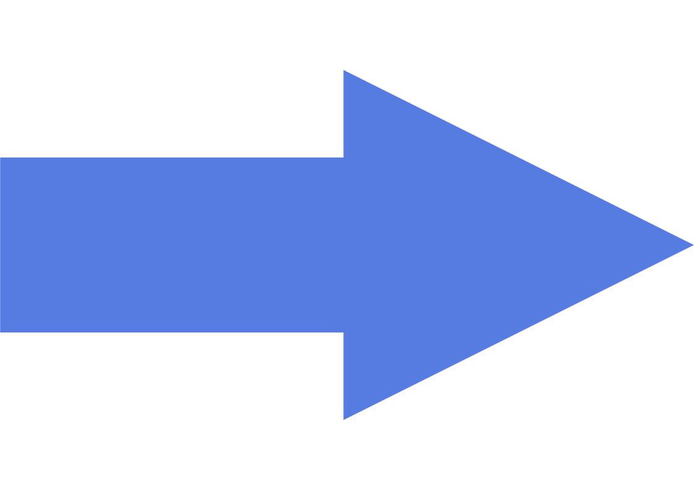

# Arrowlang

> [!WARNING]
> This language is a work in progress so some things are subject to change!

Arrowlang is a compiled stack-based programming language that is statically and strongly typed.

For information on the syntax, see the syntax.md file.
